# Sydney Resource Access Explorer


**Sydney Resource Access Explorer** is a PostGIS-backed geospatial ETL, analytics, and dashboard project for exploring how public points of interest, population, and income relate to urban resource access across Greater Sydney.

I present this repository as a portfolio case study in **geospatial data engineering**. It is not only an analysis notebook: it contains a reusable Python package, a command-line workflow runner, a PostGIS schema with spatial indexes, ArcGIS API extraction with metadata validation, deterministic polygon-based POI assignment, statistical scoring, exported report figures, and a read-only Dash dashboard.

## At A Glance

| Area | What this project demonstrates |
| --- | --- |
| Data engineering | Configurable ETL pipeline from public ArcGIS/ABS APIs into PostgreSQL/PostGIS. |
| Geospatial systems | SA2/SA4 polygon loading, SRID handling, GiST indexes, and `ST_Covers` spatial assignment. |
| Backend design | Typed configuration, explicit workflow catalog, repository layer, and CLI orchestration. |
| Analytics | POI-based resource score, population-aware sensitivity view, Pearson/Spearman correlation. |
| Visualisation | Shared Plotly figure builders for reports and a Dash dashboard backed by the same query layer. |
| Reproducibility | Raw API evidence files, SQL schema files, deterministic assignment rules, containerised PostGIS. |
| Deployment | Containerfile, GHCR image build, GitHub Actions deploy workflow, Podman/Quadlet service scripts. |

Selected run metrics from the current report evidence:

| Metric | Value |
| --- | ---: |
| Imported SA2 areas | 106 |
| Scored SA2 areas | 101 |
| Raw POI feature rows | 16,468 |
| Cleaned POI rows | 9,634 |
| Polygon-assigned POI rows | 7,894 |
| Unassigned bbox candidates | 1,740 |
| Report figure exports | 9 |
| Core analytical tables | 7 |

## Output Gallery

The hosted dashboard is currently paused to avoid server cost, but the dashboard remains runnable locally. The exported figures below are generated from the same database-backed query layer used by the dashboard.

### SA2 Resource Score Map


### POI Point Map


### Score And Income Correlation


### Database Model


## Problem

Urban resources are unevenly distributed, and the unevenness is inherently spatial. A simple facility count does not explain whether resources are concentrated around activity centres, transport corridors, coastal areas, or residential suburbs. It also does not show whether high-resource areas overlap with population density or income patterns.

This project turns public geospatial data into an auditable analytical system that can answer questions such as:

- Which SA2 areas have the highest and lowest resource scores?
- How do POI clusters align with official SA2 and SA4 statistical boundaries?
- Are high-scoring areas also higher-income areas?
- How different is the story after adjusting POI counts by resident population?
- Which POI groups dominate the resource score, and where are they concentrated?

## Why This Project Has Engineering Depth

This repository is structured as a small data product rather than a one-off notebook.

- The public APIs are queried through a reusable ArcGIS client with pagination, retry settings, metadata validation, and layer-specific field contracts.
- Raw POI API responses are stored separately from cleaned analytical records, so extraction evidence and downstream modelling are not mixed.
- SA2 bbox requests are treated only as candidate retrieval windows. The final geographic truth is assigned in PostGIS using polygon coverage checks.
- The score pipeline writes analytical outputs back to database tables instead of leaving results in notebook memory.
- The dashboard, report figures, and notebooks read from shared query and figure-builder modules, which reduces duplicated business logic.
- Destructive database actions are guarded behind explicit `--yes` flags.
- The project can run locally with `uv` and a PostGIS container, while deployment scripts package the dashboard as a containerised service.

## Architecture

```mermaid
flowchart TD
    A["ArcGIS / ABS public APIs"] --> B["Metadata validation"]
    B --> C["Paginated extraction"]
    C --> D["Raw JSON / JSONL evidence files"]
    C --> E["Clean Python records"]
    E --> F["PostgreSQL + PostGIS"]
    F --> G["Spatial assignment with ST_Covers"]
    G --> H["Resource score tables"]
    F --> I["Income tables"]
    H --> J["Score-income correlation"]
    H --> K["Plotly report figures"]
    I --> J
    J --> K
    H --> L["Dash dashboard"]
    I --> L
```



The system is organised around a few clear boundaries:

| Layer | Responsibility |
| --- | --- |
| `config.py` / `defaults.py` | Typed settings, default API contracts, output paths, and database connection options. |
| `pipeline.py` | Explicit workflow step catalog and orchestration. |
| `task2_import/` | Boundary, population, POI, and income extraction/loading. |
| `db/repositories/` | SQL write/read boundaries, schema lifecycle, and spatial assignment queries. |
| `task3_score/` | Resource score computation and correlation logic. |
| `task4/` | Dashboard queries, Plotly chart builders, map builders, and PNG export. |

## Data Sources

| Source | Role |
| --- | --- |
| NSW Points of Interest API | POI points, categories, labels, source ids, and timestamps. |
| ABS ASGS 2021 SA2 boundaries | Main statistical geography and polygon geometry for scoring. |
| ABS ASGS 2021 SA4 boundaries | Parent geography for selected region scope and validation. |
| ABS population layer | Population and density fields for filtering and sensitivity analysis. |
| ABS Personal Income in Australia | Median income fields for score-income correlation. |
| NSW region summary CSV | Historical input retained from the original analytical brief. |

The project validates API metadata before extraction. If an expected field, geometry type, or source SRID changes, the workflow fails before producing silent downstream errors.

## Data Pipeline

The main workflow is intentionally decomposed into inspectable steps:

1. `plan-import` builds the SA4/SA2 crawl plan and expected bbox request count.
2. `import-boundaries` fetches SA4/SA2 polygons, computes bbox fields, and loads boundaries.
3. `validate-boundaries` checks SA2 membership against configured parent SA4 polygons.
4. `import-poi` fetches raw POI features by SA2 bbox, persists raw evidence, cleans POIs, and writes point geometries.
5. `import-income` loads SA2-level income fields.
6. `compute-score` calculates the 0-100 resource score and score-income correlations.
7. `generate-figures` exports report-grade PNG figures from the database.
8. `dashboard` serves the read-only exploratory interface.

The configured end-to-end run executes the non-destructive import and scoring steps in order.

## Spatial Join Design

The NSW POI API is queried with rectangular SA2 bounding boxes because it is an efficient extraction strategy. A bbox can include points outside the actual polygon, so the project does not treat bbox results as final assignments.

Final assignment is performed in PostGIS:

```sql
ST_Covers(sa2.geometry, poi_clean.geometry)
```

This matters because:

- `ST_Covers` keeps POIs that lie exactly on SA2 boundaries.
- The `poi_clean` and `sa2` geometry columns have GiST indexes for spatial joins.
- Boundary duplicate candidates are handled deterministically by keeping the first `sa2_code` in ascending order.
- Unassigned bbox candidates remain explainable instead of being silently counted.

In the current evidence run, 9,634 cleaned POIs became 7,894 polygon-assigned POIs, while 1,740 bbox candidates were not assigned to an SA2 polygon in the selected scope.

## Score Model

The baseline resource score standardises POI counts within the configured score universe:

```text
z_poi = (poi_count - mean_poi_count) / std_poi_count
score_raw = sigmoid(z_poi)
score_100 = score_raw * 100
```

Design notes:

- `poi_count` comes from final `sa2_poi` polygon assignments, not bbox candidates.
- Very-low-population SA2s are excluded by `task3_score.min_population`.
- Score outputs store raw inputs, z-scores, scaled score values, score version, and score universe.
- A population-adjusted POI density map is exported as a sensitivity view, not as a replacement for the baseline score.
- Pearson and Spearman correlations are computed against median income to separate linear and rank-based relationships.

This makes the score auditable: a dashboard user can inspect the final score while an engineer can trace the score back to the source tables and formula inputs.

## Database Design

The analytical database separates source-like entities from derived outputs:

| Table | Purpose |
| --- | --- |
| `sa4` | Parent geography and SA4 polygon boundaries. |
| `sa2` | Main scoring unit, SA2 polygon boundaries, bbox fields, population fields. |
| `poi_clean` | Cleaned POI attributes plus PostGIS point geometry. |
| `sa2_poi` | Bridge table for final POI-to-SA2 polygon assignment. |
| `sa2_income` | SA2-level income fields and source metadata. |
| `sa2_score` | Score inputs and outputs for each score version/universe. |
| `score_income_correlation` | Pearson/Spearman test outputs and significance flags. |

Indexing is designed around the real query patterns:

- GiST indexes on point and polygon geometry columns for spatial joins and maps.
- B-tree indexes on SA4 code, population, score version/universe, score value, income, and POI group filters.
- Foreign keys connect boundaries, assignments, scores, and income records while keeping derived outputs separate.

## Dashboard And Reporting

The dashboard is read-only and backed by the same PostGIS database used by the CLI and report exports. It supports:

- SA4, SA2, and POI group filtering.
- KPI cards for selected scope summaries.
- score maps and POI point maps.
- score distribution, ranking, and POI group charts.
- score-income scatter plots.
- tabular views for SA2 and SA4 summaries.

Report figures are generated with Plotly/Kaleido so that the notebook/report path and dashboard path share visual logic instead of drifting into separate implementations.

## Deployment

The repository includes deployment infrastructure to show that the work can move beyond local notebooks:

- `Containerfile.app` builds the Dash/Gunicorn application image.
- `.github/workflows/deploy.yml` compiles the package, builds the image, pushes to GHCR, and can deploy to a remote server.
- `containers/quadlet/` contains Podman Quadlet units for PostGIS and the dashboard service.
- `scripts/deploy/deploy_server.sh` prepares a user-level Podman deployment, runs database reset/workflow commands, and restarts the dashboard service.
- `scripts/deploy/measure_resource_usage.py` helps size the pipeline and dashboard on small cloud hosts.

The public dashboard is currently offline while the server is paused for cost control. The local dashboard path remains fully available.

## Tech Stack

| Category | Tools |
| --- | --- |
| Language/runtime | Python 3.12, uv |
| Data processing | pandas, numpy |
| Statistical analysis | scipy |
| API access | requests, ArcGIS REST query endpoints |
| Database | PostgreSQL 16, PostGIS, SQLAlchemy, psycopg |
| Visualisation | Plotly, Kaleido, Dash |
| Containers | Podman Compose, Containerfile, Gunicorn |
| Deployment | GitHub Actions, GHCR, SSH deployment, Podman Quadlet |
| Documentation | Markdown, Mermaid diagrams, report figures |

## Quick Start

Requirements:

- Python 3.12
- uv
- Podman or Docker Compose
- Chrome or Kaleido-managed Chrome for PNG export

Install dependencies:

```bash
uv sync
```

Create local configuration:

```bash
cp configs/example.yaml configs/local.yaml
```

Start PostGIS:

```bash
podman compose up -d
```

Initialize and check the database:

```bash
uv run sra-explorer init-db
uv run sra-explorer check-db
```

Preview the API crawl plan:

```bash
uv run sra-explorer plan-import
```

Run the configured workflow:

```bash
uv run sra-explorer run-workflow
```

Export report figures:

```bash
uv run sra-explorer generate-figures
```

Start the local dashboard:

```bash
uv run sra-explorer dashboard
```

Then open the local URL printed by Dash, usually `http://127.0.0.1:8050`.

If Kaleido cannot find Chrome locally, install its managed browser:

```bash
uv run plotly_get_chrome
```

## CLI Reference

| Command | Purpose |
| --- | --- |
| `uv run sra-explorer init-db` | Initialise schema, extensions, tables, and indexes. |
| `uv run sra-explorer check-db` | Check database connection, PostGIS, tables, and SRID. |
| `uv run sra-explorer plan-import` | Print planned SA4, SA2, and bbox crawl counts without importing POIs. |
| `uv run sra-explorer import-boundaries` | Fetch and store SA2/SA4 boundaries and population. |
| `uv run sra-explorer validate-boundaries` | Validate imported SA2 polygons against configured SA4 polygons. |
| `uv run sra-explorer import-poi` | Fetch raw POI JSON, clean records, and spatially assign POIs. |
| `uv run sra-explorer import-income` | Fetch and store SA2 median income data. |
| `uv run sra-explorer compute-score` | Recompute the resource score and income correlation. |
| `uv run sra-explorer run-workflow` | Run the configured end-to-end workflow. |
| `uv run sra-explorer generate-figures` | Export PNG figures. |
| `uv run sra-explorer dashboard` | Start the read-only Dash dashboard. |
| `uv run sra-explorer clear-db --yes` | Clear business table contents while keeping schema and indexes. |
| `uv run sra-explorer reset-db --yes` | Drop and reinitialise the business schema. |

Run with an explicit config:

```bash
uv run sra-explorer --config configs/local.yaml run-workflow
```

## Configuration

The project uses layered settings:

| Layer | Purpose |
| --- | --- |
| `src/data2001/defaults.py` | Stable defaults for API layers, workflow steps, scoring, output paths, and dashboard settings. |
| `configs/example.yaml` | Copyable local template. |
| `configs/local.yaml` | Local runtime overrides, intentionally ignored by git. |
| `DATA2001_DATABASE_*` | Deployment-time database overrides retained for compatibility. |

Commonly edited settings:

- `task2_import.crawl_scope`: choose Greater Sydney, selected SA4 names, or explicit SA4 codes.
- `task3_score.score_universe`: choose the comparison universe for score standardisation.
- `task3_score.min_population`: exclude very-low-population SA2 records.
- `income.min_income_earners`: filter small income samples.
- `charts.scale` and `outputs.charts_dir`: control report figure export.
- `dashboard.host`, `dashboard.port`, and `dashboard.default_top_n`: control local dashboard serving.

## Repository Layout

```text
configs/                    YAML runtime configuration
data/raw/task1/             Historical source CSV from the original brief
data/raw/poi_api/           POI raw JSON / JSONL outputs
docs/                       API, architecture, database, and container notes
notebooks/                  Reproducibility notebooks and evidence notebooks
report/                     Report draft and exported figures
sql/                        PostGIS extension, schema, and index SQL
src/data2001/               Python package retained for internal compatibility
compose.yml                 Local PostGIS startup entry point
Containerfile.app           Dashboard application image
```

Important package areas:

```text
task1_cleaning/     Historical CSV cleaning workflow from the original brief
task1_statistics/   Historical derived statistics functions
task2_import/       ArcGIS import, POI cleaning, boundary loading, spatial assignment
task3_score/        Resource scoring and score-income correlation
task4/              Shared Plotly figures, maps, dashboard queries, and Dash app
db/repositories/    Database lifecycle, read queries, writes, and spatial SQL
common/             Paths, progress reporting, and shared types
config.py           Typed settings and environment overrides
pipeline.py         Explicit workflow step catalog and runner
```

## What I Would Highlight In An Interview

- I turned a coursework-style analytical brief into a reproducible data product with CLI, database schema, and dashboard layers.
- I separated bbox extraction from polygon assignment, which avoids a common geospatial mistake where rectangular API hits are treated as final truth.
- I designed the database so source entities, bridge assignments, derived scores, and correlation outputs remain inspectable.
- I made workflow steps independently runnable so failures can be debugged without rerunning the entire pipeline.
- I kept raw API evidence files, field contracts, and generated figures so the analysis is auditable.
- I containerised the application and wrote deployment scripts, showing the project can run as a service rather than only as local notebooks.

## Origin & Ownership

This project began as a DATA2001 group assignment and is now maintained as a portfolio case study. I keep that origin visible because provenance matters, especially when coursework evolves into a public engineering artifact.

My contribution focused on the engineering backbone of the project:

- project configuration, CLI workflow runner, and typed settings;
- PostgreSQL/PostGIS schema, indexes, lifecycle commands, and repository layer;
- ArcGIS/ABS boundary, POI, population, and income ingestion;
- raw POI evidence persistence, POI cleaning, and polygon-based spatial assignment;
- resource score computation and score-income correlation pipeline;
- Plotly figure export, shared dashboard query layer, and Dash dashboard support;
- deployment scripts for GHCR image publishing and Podman/Quadlet service hosting.

The original report appendix includes contribution notes and commit hashes, and the repository history preserves the development trail. In the current public-facing version, the internal package path and deployment environment names still use `data2001` for compatibility, while the product identity and CLI are presented as Sydney Resource Access Explorer.

## Limitations And Next Steps

The current score is intentionally simple and auditable. It measures POI concentration, not service quality, capacity, opening hours, accessibility by travel time, or actual resident demand.

Potential next steps:

- add category-specific POI weights;
- add network travel time or public transport accessibility;
- support full Greater Sydney runs as the default public demo;
- add automated tests around scoring, API parsing, and SQL query generation;
- publish a lightweight dashboard screenshot set while the hosted server remains paused;
- add a small seed dataset or fixture mode for faster demo runs without live API calls.

## Documentation

- [API Reference](docs/api_reference.md): API endpoints, expected fields, field mappings, and persisted workflow files.
- [Architecture Design](docs/architecture_design.md): configuration flow, workflow steps, module boundaries, and call-chain diagrams.
- [Database Reference](docs/database_reference.md): tables, keys, indexes, ERD, and spatial join design.
- [Database Container Setup](docs/database_container_setup.md): local PostGIS setup and smoke tests.
- [Final Report Draft](report/report.md): analytical interpretation, figures, limitations, and contribution appendix.
