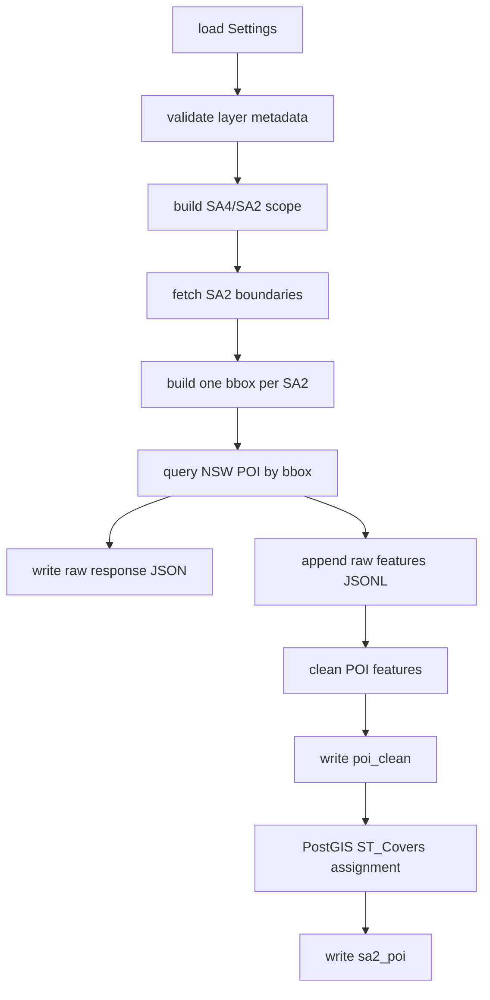

# API Reference

## Source of Truth

| Type | Location | Notes |
| --- | --- | --- |
| Default settings | `src/data2001/defaults.py` | Endpoints, field contracts, output paths, pagination, and retry defaults. |
| Settings types | `src/data2001/config.py` | `Settings` dataclasses and YAML merge rules. |
| Local config | `configs/local.yaml` | Runtime overrides for local runs. |
| Example config | `configs/example.yaml` | Shared template for group members. |
| ArcGIS client | `src/data2001/task2_import/api/arcgis_client.py` | Metadata validation, pagination, retry, and count queries. |
| POI import | `src/data2001/task2_import/poi/poi_import.py` | Raw POI response persistence, features JSONL, cleaning, loading, and spatial assignment. |
| Figure export | `src/data2001/task4/export.py` | Report PNG export entry point. |

## Dictionary

### Global API Settings

| Setting | Default | Purpose |
| --- | --- | --- |
| `api.page_size` | `1000` | ArcGIS page size, used as `resultRecordCount`. |
| `api.timeout_seconds` | `30` | HTTP request timeout. |
| `api.max_retries` | `3` | Maximum retry attempts after a failed request. |
| `api.sleep_seconds` | `0.2` | Base delay between retries. |
| `api.out_sr` | `4326` | API output spatial reference and the coordinate system used before database load. |

### ArcGIS Response Shape

| Field | Type | Purpose |
| --- | --- | --- |
| `features` | list | Main data array. Each item is one feature. |
| `features[].attributes` | object | Non-spatial fields. |
| `features[].geometry` | object | Point or polygon geometry. |
| `exceededTransferLimit` | bool | Used to decide whether another `resultOffset` page is needed. |
| `error` | object | If present, the client raises an exception and stops the workflow. |

### Metadata Validation

Each layer is validated through its metadata URL before data extraction. If fields, geometry type, or SRID do not match the configured contract, the workflow stops instead of producing results from a changed interface.

| Layer URL | Metadata URL |
| --- | --- |
| `.../query` | Remove the trailing `/query`. |

### Layer: `poi`

| Item | Value |
| --- | --- |
| Endpoint | `https://maps.six.nsw.gov.au/arcgis/rest/services/public/NSW_POI/MapServer/0/query` |
| Metadata URL | `https://maps.six.nsw.gov.au/arcgis/rest/services/public/NSW_POI/MapServer/0` |
| `geometry_type` | `esriGeometryPoint` |
| `expected_srid` | `4283` |
| Request geometry | SA2 bbox envelope |
| Request spatial relation | `esriSpatialRelIntersects` |

Expected / out fields:

```text
objectid
topoid
poigroup
poitype
poiname
poilabel
poilabeltype
poialtlabel
poisourcefeatureoid
accesscontrol
startdate
enddate
lastupdate
msoid
centroidid
shapeuuid
changetype
processstate
urbanity
```

Field mapping:

| API field | Internal / database field | Notes |
| --- | --- | --- |
| `objectid` | `poi_clean.objectid` | POI primary key. |
| `poigroup` | `poigroup_code` | POI group code. |
| `poigroup` | `poigroup_name` | Converted through `poi.group_names`. |
| `geometry.x` | `longitude` | Longitude. |
| `geometry.y` | `latitude` | Latitude. |
| `geometry.x/y` | `poi_clean.geometry` | `ST_SetSRID(ST_MakePoint(longitude, latitude), 4326)`. |

POI group lookup:

| Code | Name |
| --- | --- |
| `1` | `Community` |
| `2` | `Education` |
| `3` | `Recreation` |
| `4` | `Transport` |
| `5` | `Utility` |
| `6` | `Hydrography` |
| `7` | `Landform` |
| `8` | `Place` |
| `9` | `Industry` |

### Layer: `sa2`

| Item | Value |
| --- | --- |
| Endpoint | `https://geo.abs.gov.au/arcgis/rest/services/ASGS2021/SA2/FeatureServer/0/query` |
| Metadata URL | `https://geo.abs.gov.au/arcgis/rest/services/ASGS2021/SA2/FeatureServer/0` |
| `geometry_type` | `esriGeometryPolygon` |
| `expected_srid` | `3857` |
| `where` source | `task2_import.crawl_scope` |
| `outSR` | `4326` |

Expected / out fields:

```text
sa2_code_2021
sa2_name_2021
sa3_code_2021
sa3_name_2021
sa4_code_2021
sa4_name_2021
gccsa_code_2021
gccsa_name_2021
state_code_2021
state_name_2021
area_albers_sqkm
asgs_loci_uri_2021
```

Field mapping:

| API field | Database field |
| --- | --- |
| `sa2_code_2021` | `sa2.sa2_code` |
| `sa2_name_2021` | `sa2.sa2_name` |
| `sa3_code_2021` | `sa2.sa3_code` |
| `sa3_name_2021` | `sa2.sa3_name` |
| `sa4_code_2021` | `sa2.sa4_code` |
| `sa4_name_2021` | `sa2.sa4_name` |
| `gccsa_code_2021` | `sa2.gccsa_code` |
| `gccsa_name_2021` | `sa2.gccsa_name` |
| `state_code_2021` | `sa2.state_code` |
| `state_name_2021` | `sa2.state_name` |
| `area_albers_sqkm` | `sa2.area_albers_sqkm` |
| `asgs_loci_uri_2021` | `sa2.asgs_loci_uri` |
| `geometry.rings` | `sa2.geometry` |
| computed bbox | `bbox_minx`, `bbox_miny`, `bbox_maxx`, `bbox_maxy` |

### Layer: `sa4`

| Item | Value |
| --- | --- |
| Endpoint | `https://geo.abs.gov.au/arcgis/rest/services/ASGS2021/SA4/MapServer/0/query` |
| Metadata URL | `https://geo.abs.gov.au/arcgis/rest/services/ASGS2021/SA4/MapServer/0` |
| `geometry_type` | `esriGeometryPolygon` |
| `expected_srid` | `3857` |
| `where` source | `task2_import.crawl_scope` |
| `outSR` | `4326` |

Expected / out fields:

```text
sa4_code_2021
sa4_name_2021
gccsa_code_2021
gccsa_name_2021
state_code_2021
state_name_2021
area_albers_sqkm
asgs_loci_uri_2021
```

Field mapping:

| API field | Database field |
| --- | --- |
| `sa4_code_2021` | `sa4.sa4_code` |
| `sa4_name_2021` | `sa4.sa4_name` |
| `gccsa_code_2021` | `sa4.gccsa_code` |
| `gccsa_name_2021` | `sa4.gccsa_name` |
| `state_code_2021` | `sa4.state_code` |
| `state_name_2021` | `sa4.state_name` |
| `area_albers_sqkm` | `sa4.area_albers_sqkm` |
| `asgs_loci_uri_2021` | `sa4.asgs_loci_uri` |
| `geometry.rings` | `sa4.geometry` |
| computed bbox | `bbox_minx`, `bbox_miny`, `bbox_maxx`, `bbox_maxy` |

### Layer: `population`

| Item | Value |
| --- | --- |
| Endpoint | `https://geo.abs.gov.au/arcgis/rest/services/Hosted/ABS_Population_and_people_by_2021_SA2_Nov_2023/FeatureServer/1/query` |
| Metadata URL | `https://geo.abs.gov.au/arcgis/rest/services/Hosted/ABS_Population_and_people_by_2021_SA2_Nov_2023/FeatureServer/1` |
| `geometry_type` | `esriGeometryPolygon` |
| `expected_srid` | `4283` |

Expected / out fields:

```text
sa2_code_2021
sa2_name_2021
erp_p_202022
erp_212022
area_albers_sqkm
```

Field mapping:

| API field | Internal / database field |
| --- | --- |
| `sa2_code_2021` | join key: `sa2.sa2_code` |
| `erp_p_202022` | `sa2.population` |
| `erp_212022` | `sa2.population_density` |

### Layer: `income`

| Item | Value |
| --- | --- |
| Endpoint | `https://geo.abs.gov.au/arcgis/rest/services/Hosted/Personal_Income_in_Australia_2022_23_SA2_2021/FeatureServer/0/query` |
| Metadata URL | `https://geo.abs.gov.au/arcgis/rest/services/Hosted/Personal_Income_in_Australia_2022_23_SA2_2021/FeatureServer/0` |
| `geometry_type` | `esriGeometryPolygon` |
| `expected_srid` | `7844` |

Expected / out fields:

```text
sa2_code_2021
sa2_name_2021
income_earners_23
income_earners_22
change_from_prev_year_23_22
change_from_prev_year_pct_23_22
median_income_23
```

Field mapping:

| API field | Database field |
| --- | --- |
| `sa2_code_2021` | `sa2_income.sa2_code` |
| `sa2_name_2021` | `sa2_income.sa2_name` |
| `income_earners_23` | `income_earners_2022_23` |
| `income_earners_22` | `income_earners_2021_22` |
| `change_from_prev_year_23_22` | `income_earners_change` |
| `change_from_prev_year_pct_23_22` | `income_earners_change_pct` |
| `median_income_23` | `median_income_2022_23` |
| config value | `source_year`, `source_name` |

### `task2_import.crawl_scope`

| Scope | where clause design | Purpose |
| --- | --- | --- |
| `greater_sydney` | `gccsa_name_2021 = 'Greater Sydney'` | Default full scope. |
| `selected_sa4` | `sa4_name_2021 IN (...)` | Uses `selected_sa4_by_member`. |
| `explicit_sa4_codes` | `sa4_code_2021 IN (...)` | Small-scope testing or fixed SA4 selection. |

### Workflow Persisted Files

| File / path | Producing step | Code entry point | Config source | Purpose | Overwrite rule |
| --- | --- | --- | --- | --- | --- |
| `data/processed/cleaned_data.csv` | Task 1 cleaning | `run_task1_cleaning` | `outputs.processed_task1_cleaned_csv` | Cleaned NSW statistics CSV. | Re-running overwrites it. |
| `data/statistics/statistics_output.csv` | Task 1 statistics standalone script | `task1_statistics/workflow.py` | fixed path in code | Combined derived statistics for all members. | Re-running overwrites it. |
| `data/raw/poi_api/responses/response_*.json` | `import_poi` fetch stage | `write_raw_response_file` | `outputs.raw_poi_response_dir` | Stores each API response page and request params. | `prepare_poi_raw_files` deletes old JSON first. |
| `data/raw/poi_api/features.jsonl` | `import_poi` fetch stage | `append_features_jsonl` | `outputs.raw_poi_features_jsonl` | Stores raw features line by line for streaming clean/load. | `prepare_poi_raw_files` deletes the old file first. |
| `report/figures/score_histogram.png` | `generate-figures` | `export_report_charts` | `outputs.charts_dir` | Score distribution chart. | Re-export overwrites it. |
| `report/figures/top_sa2_score.png` | `generate-figures` | `export_report_charts` | `outputs.charts_dir` | Top SA2 bar chart. | Re-export overwrites it. |
| `report/figures/bottom_sa2_score.png` | `generate-figures` | `export_report_charts` | `outputs.charts_dir` | Bottom SA2 bar chart. | Re-export overwrites it. |
| `report/figures/poi_group_distribution.png` | `generate-figures` | `export_report_charts` | `outputs.charts_dir` | POI group distribution. | Re-export overwrites it. |
| `report/figures/score_income_correlation.png` | `generate-figures` | `export_report_charts` | `outputs.charts_dir` | Score-income scatter plot. | Re-export overwrites it. |
| `report/figures/sa2_score_choropleth.png` | `generate-figures` | `export_report_charts` | `outputs.charts_dir` | SA2 score choropleth. | Re-export overwrites it. |
| `report/figures/poi_point_scatter.png` | `generate-figures` | `export_report_charts` | `outputs.charts_dir` | POI point scatter map. | Re-export overwrites it. |

## Design Notes

### API Extraction Design



- Bbox requests reduce the NSW POI API search area; they are not the final SA2 assignment.
- Final assignment uses `ST_Covers(sa2.geometry, poi_clean.geometry)`. Boundary duplicates are resolved by keeping the first `sa2_code` in ascending order.

### Pagination and Retry

| Behaviour | Design |
| --- | --- |
| Pagination | Each page adds `resultRecordCount` and `resultOffset`. |
| Stop condition | `exceededTransferLimit` is false, or returned feature count is smaller than page size. |
| Retry | `requests.get` failures, HTTP errors, and ArcGIS errors are retried. |
| Error handling | If retries are exhausted, an exception is raised and the workflow stops. |

## Cross References

| Document | Contents |
| --- | --- |
| `docs/architecture_design.md` | Module structure, workflow call chain, and internal boundaries. |
| `docs/database_reference.md` | Tables, indexes, spatial join, and ERD. |
| `README.md` | Quick start and common commands. |
| `report/report.md` | Final report template. |
