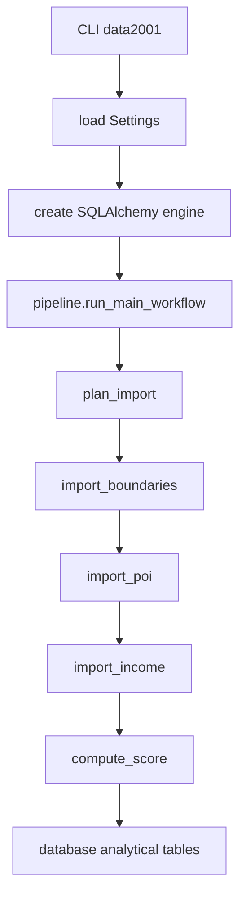
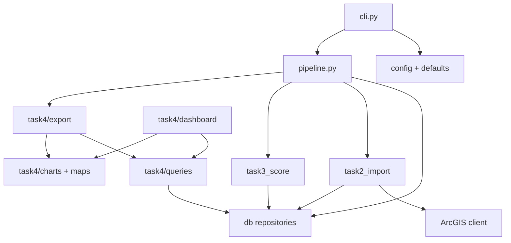
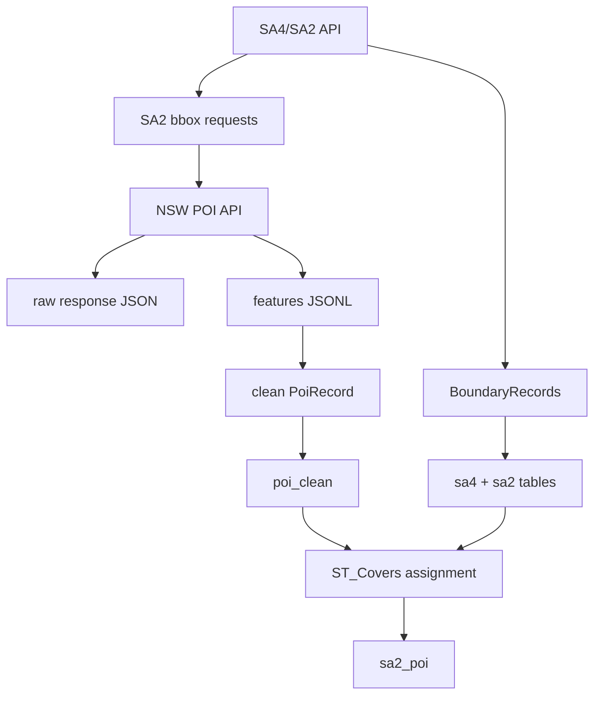
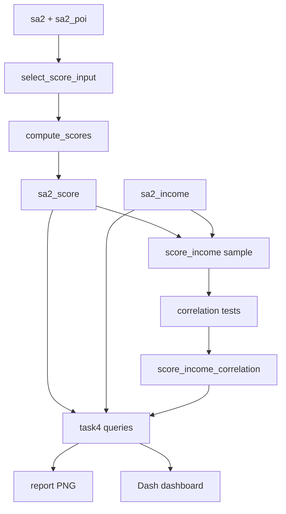

# Architecture Design

## Source of Truth

| Type | Location | Notes |
| --- | --- | --- |
| CLI entry point | `src/data2001/cli.py` | Parses commands, loads settings, creates the engine, and calls the pipeline. |
| Workflow catalog | `src/data2001/pipeline.py` | `STEP_DEFINITIONS`, step ids, CLI commands, and workflow execution. |
| Default settings | `src/data2001/defaults.py` | Default settings for endpoints, paths, workflow, score, and dashboard. |
| Settings types | `src/data2001/config.py` | Settings dataclasses, YAML merge, and environment overrides. |
| Database layer | `src/data2001/db/` | Engine, schema admin, read repositories, and write repositories. |
| Task modules | `src/data2001/task*/` | Business logic for each assignment task. |
| Dashboard | `src/data2001/task4/dashboard/` | Dash app layout, callbacks, and helpers. |

## Dictionary

### Project Layout

| Path | Responsibility |
| --- | --- |
| `configs/` | YAML configuration files. `local.yaml` overrides defaults; `example.yaml` is shared with group members. |
| `data/raw/task1/` | Raw Task 1 CSV input. |
| `data/raw/poi_api/` | NSW POI raw JSON and JSONL. |
| `data/processed/` | Task 1 cleaned CSV. |
| `docs/` | Internal reference docs and container/deployment notes. |
| `notebooks/` | Full workflow and member notebooks. |
| `report/` | Report markdown and figures. |
| `sql/` | PostGIS extension, schema, and index SQL. |
| `src/data2001/` | Main Python package. |
| `compose.yml` | Local PostGIS container entry point. |

### Configuration Architecture

| Layer | Location | Purpose |
| --- | --- | --- |
| defaults | `DEFAULT_SETTINGS_DATA` | All default endpoints, paths, workflow, score, and dashboard settings. |
| YAML override | `configs/local.yaml` | Local runtime differences such as database port and selected SA4s. |
| env override | `DATA2001_DATABASE_*` | Database connection overrides for container deployment. |
| runtime object | `Settings` | Shared configuration object passed into workflows and tasks. |

`load_settings()` deep-merges defaults and YAML, applies database environment overrides, and then builds frozen dataclasses.

### CLI Command Dictionary

| Command | Step id | Destructive | Entry point | Output |
| --- | --- | --- | --- | --- |
| `init-db` | `init_db` | no | `run_init_db_step` | Creates schema, extension, tables, and indexes. |
| `check-db` | `check_db` | no | `run_check_db_step` | Checks connection, PostGIS, tables, and SRID. |
| `plan-import` | `plan_import` | no | `run_plan_import_step` | Returns SA4, SA2, and bbox request counts. |
| `import-boundaries` | `import_boundaries` | no | `run_import_boundaries_step` | Writes `sa4`, `sa2`, and population fields. |
| `import-poi` | `import_poi` | no | `run_import_poi_step` | Persists raw POI, writes `poi_clean`, and writes `sa2_poi`. |
| `import-income` | `import_income` | no | `run_import_income_step` | Writes `sa2_income`. |
| `compute-score` | `compute_score` | no | `run_compute_score_step` | Writes `sa2_score` and `score_income_correlation`. |
| `generate-figures` | `export_charts` | no | `run_export_charts_step` | Exports report PNG figures. |
| `clear-db --yes` | `clear_db` | yes | `run_clear_db_step` | Clears business table data. |
| `reset-db --yes` | `reset_db` | yes | `run_reset_db_step` | Drops and rebuilds the schema. |
| `run-workflow` | configured steps | maybe | `run_main_workflow` | Runs `workflow.enabled_steps`. |
| `dashboard` | n/a | no | `create_dashboard_app` | Starts the Dash app. |

### Default Main Workflow

```text
plan_import
import_boundaries
import_poi
import_income
compute_score
```

`generate-figures` and `dashboard` are not part of the default main workflow. They reuse results already stored in the database.

### Module Responsibilities

| Module | Responsibility | Boundary |
| --- | --- | --- |
| `common` | Paths, progress, and shared types. | No business logic. |
| `config/defaults` | Settings data and settings objects. | Does not run workflows directly. |
| `db/engine` | SQLAlchemy engine creation. | Connection only. |
| `db/repositories/admin` | Schema init/check/clear/reset. | Executes SQL files and manages schema lifecycle. |
| `db/repositories/read` | Score and correlation input queries. | Returns row dicts, no business calculation. |
| `db/repositories/write` | Upserts and spatial assignment. | Central SQL write boundary. |
| `task1_cleaning` | CSV cleaning steps. | Input/output is Pandas DataFrame. |
| `task1_statistics` | Member derived statistics. | Outputs `StatisticResult` rows. |
| `task2_import/api` | ArcGIS client and metadata validation. | Does not know business tables. |
| `task2_import/boundaries` | SA4/SA2 scope, bbox, and population import. | Produces boundary records and writes them. |
| `task2_import/poi` | POI bbox requests, raw files, cleaning, and spatial assignment. | Raw files plus `poi_clean` / `sa2_poi`. |
| `task2_import/income` | Income API extraction and loading. | Writes `sa2_income`. |
| `task3_score` | Score formula and income correlation. | Writes `sa2_score` and `score_income_correlation`. |
| `task4/queries` | Report/dashboard data queries. | Returns DataFrames. |
| `task4/charts` | Non-map Plotly figures. | Does not query the database directly. |
| `task4/maps` | Map Plotly figures. | Does not query the database directly. |
| `task4/export` | PNG export. | Combines queries and figure builders. |
| `task4/dashboard` | Dash app. | Combines queries, layout, and callbacks. |

### Internal Record Types

| Type | Module | Purpose |
| --- | --- | --- |
| `ArcGISFeature` | `task2_import.records` | ArcGIS feature dict alias. |
| `ArcGISPayload` | `task2_import.records` | ArcGIS payload dict alias. |
| `Sa4AreaRecord` | `task2_import.records` | Boundary record before writing `sa4`. |
| `Sa2AreaRecord` | `task2_import.records` | Boundary record before writing `sa2`. |
| `Sa2PopulationRecord` | `task2_import.records` | Updates `sa2.population` and density. |
| `PoiRecord` | `task2_import.records` | Clean POI record before writing `poi_clean`. |
| `Sa2IncomeRecord` | `task2_import.records` | Income record before writing `sa2_income`. |
| `ScoreInputRecord` | `task3_score.records` | Score calculation input. |
| `Sa2ScoreRecord` | `task3_score.records` | Score record written to `sa2_score`. |
| `ScoreIncomeSampleRecord` | `task3_score.records` | Correlation sample. |
| `CorrelationResult` | `task3_score.records` | Correlation output. |

## Design Notes

### Main Workflow Call Chain



Each step returns a `StepSummary`. `execute_workflow_steps()` runs steps in order and merges their summaries.

### Module Dependency Graph



Task modules can call repositories, but repositories do not depend on task modules. This keeps SQL writes centralised while report/dashboard code can reuse query and figure builders.

### Task 2 Data Flow



Raw files preserve API evidence, while the database stores the cleaned analytical structure. Bbox extraction and polygon spatial join are separated so bbox candidates are not treated as final assignment.

### Task 3 / Task 4 Data Flow



Score calculation and visualisation are decoupled: Task 3 writes analytical tables, while Task 4 reads those results to build figures and the dashboard.

## Cross References

| Document | Contents |
| --- | --- |
| `docs/api_reference.md` | Endpoints, field contracts, and persisted API files. |
| `docs/database_reference.md` | Database tables, indexes, ERD, and spatial join. |
| `docs/database_container_setup.md` | Local PostGIS container setup. |
| `docs/deployment.md` | CI/CD and cloud deployment. |
