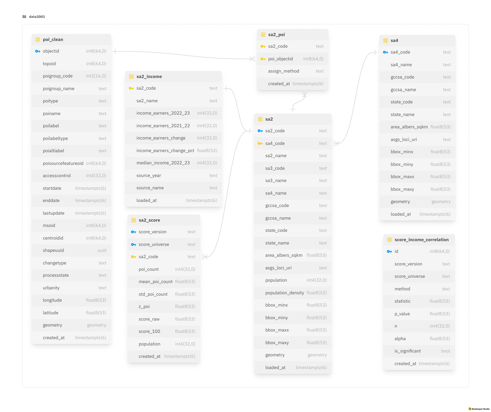
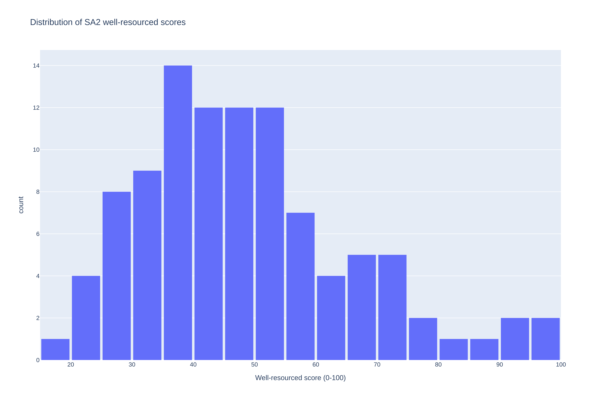
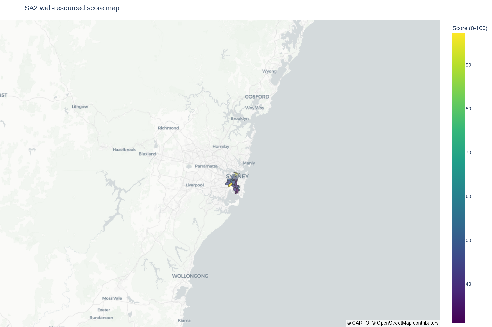
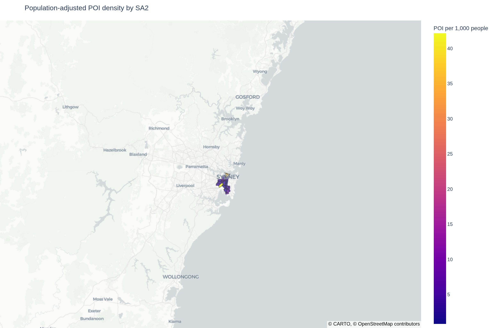
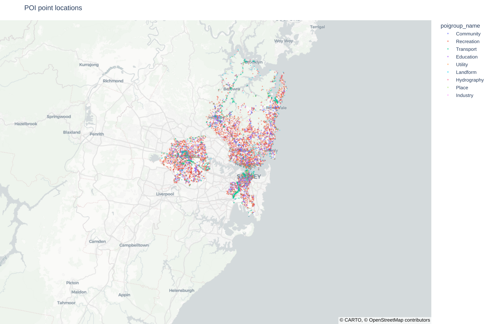
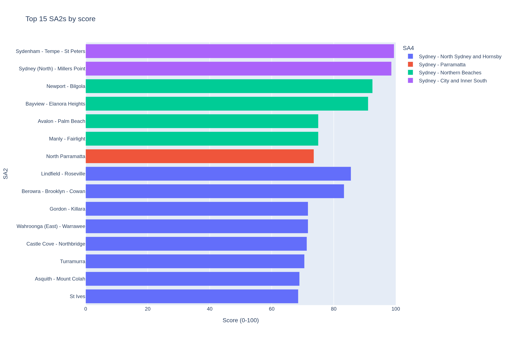
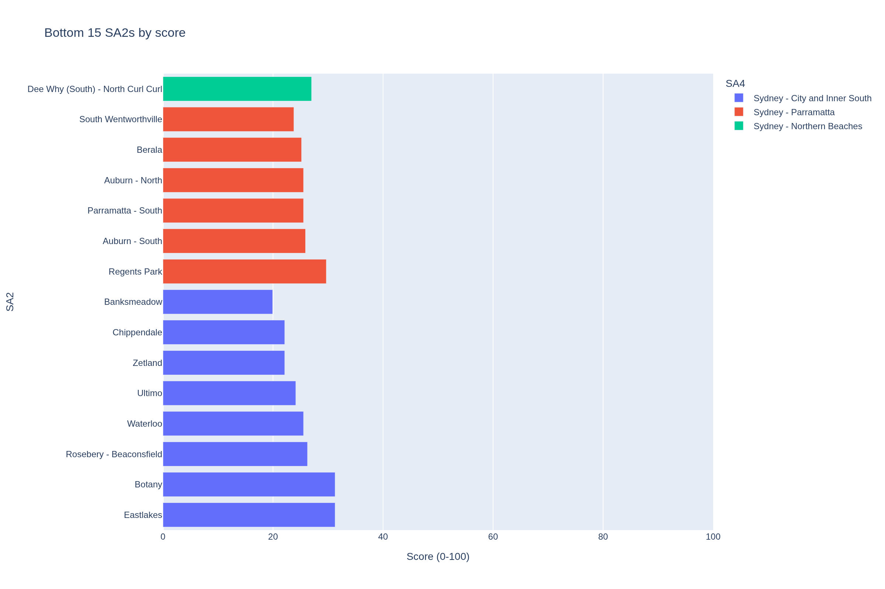
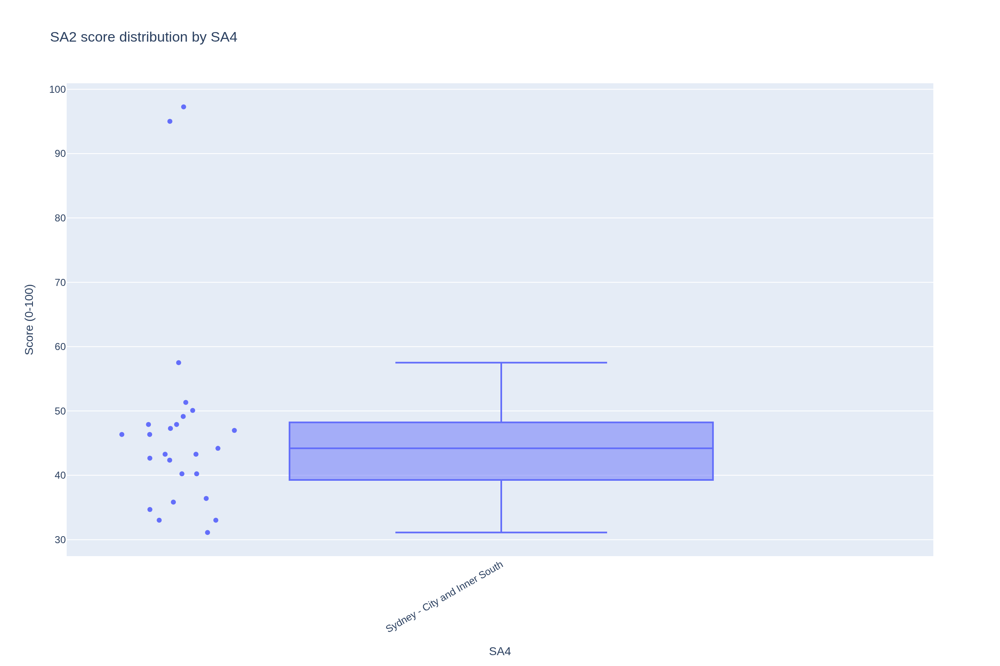
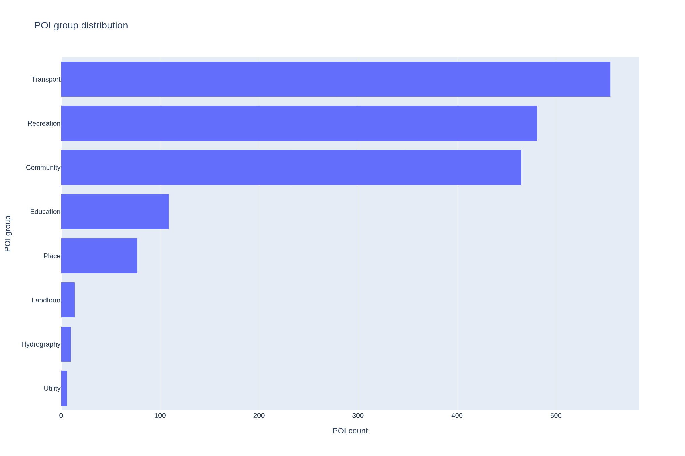
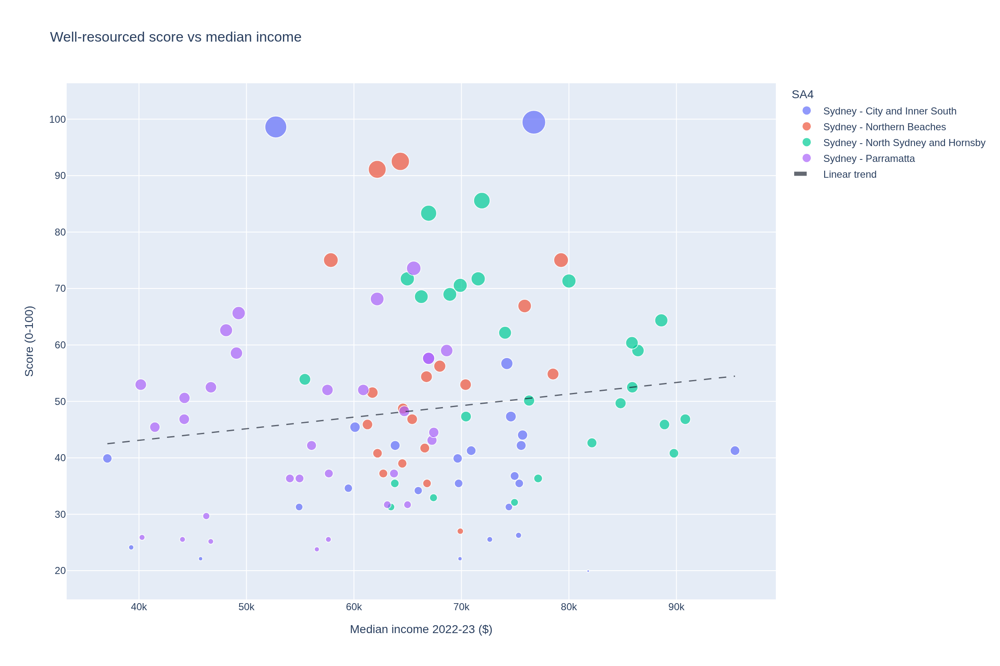

# Greater Sydney Resource Distribution Analysis

## Project Overview

This project investigates how urban resources are distributed across different areas of Greater Sydney using POI data, census information, and spatial analysis methods. The main focus of the project is to compare how well different SA2 regions are resourced and whether there are noticeable differences between highly urbanised and more suburban areas.

The project began with cleaning and preparing the raw datasets. Several preprocessing steps were applied, including standardising column names, handling missing values, reshaping the data structure, and preparing geographic boundary information for later analysis and mapping. These steps were necessary to make the datasets easier to work with and more consistent across different tasks.

After the cleaning stage, POI data from categories such as recreation, transport, education, and community facilities were analysed. A scoring workflow was then used to calculate a well-resourced score for each SA2 region based mainly on the concentration of POIs and related indicators.

Different visualisations were produced during the analysis process, including score maps, POI distribution maps, ranking charts, and comparisons between well-resourced scores and median income levels. These visualisations helped show how accessibility and resource concentration varied between different parts of Sydney.

## Evidence Map

| Rubric area | Primary evidence | Report coverage |
| --- | --- | --- |
| Data Import | `full_workflow.ipynb`, Section 3: Data Source Summary; Section 5: Task 2 API Extraction and Crawl Plan | Dataset summary and extraction evidence pointers. |
| Database Schema | `full_workflow.ipynb`, Section 4: Database Schema and Indexes; `database_reference.md`, Section: Dictionary | ERD, table roles, geometry, and index summary. |
| Spatial Join | `full_workflow.ipynb`, Section 6: Spatial Join Evidence; `task2_task3_analysis.ipynb`, Section: Task 2 Evidence | `ST_Covers` explanation and assignment summary table placeholder. |
| API Extraction | `full_workflow.ipynb`, Section 5: Task 2 API Extraction and Crawl Plan; `api_reference.md`, Section: Design Notes | API workflow summary and extraction summary table placeholder. |
| Score Calculation | `full_workflow.ipynb`, Section 7: Task 3 Score Calculation | Score formula, score universe, population filter, and rationale. |
| Indexing | `full_workflow.ipynb`, Section 4: Database Schema and Indexes; `database_reference.md`, Section: Dictionary | Short index design summary. |
| Dataset Description | `full_workflow.ipynb`, Section 3: Data Source Summary; `api_reference.md`, Section: Dictionary | Concise dataset table. |
| Database Description | `report.md`, Section: Database Schema and Indexing; `database_reference.md`, Section: Dictionary | ERD and compact schema table. |
| Results Analysis | `full_workflow.ipynb`, Section 8: Results Analysis; `task2_task3_analysis.ipynb`, Section: Individual Visual Analysis | Report-level figure interpretation placeholders. |
| Correlation Analysis | `full_workflow.ipynb`, Section 9: Correlation Analysis | Pearson/Spearman result table and interpretation placeholders. |
| Data Visualisations | `full_workflow.ipynb`, Section 10: Report Figures | All generated report figures are included below. |
| Report Quality | `report.md`, Section: Full report | Concise report structure with technical details linked to notebooks and docs. |

## Data Sources and Study Scope

Detailed endpoint contracts and field mappings are documented in `api_reference.md`, Section: Dictionary.

- NSW Region Summary CSV
  - Endpoint / path: `data/raw/task1/raw_data.csv`
  - Role in analysis: raw Task 1 input for cleaning and member-derived statistics.
  - Evidence: `full_workflow.ipynb`, Section 2; `task1_statistics.ipynb`, Section: Individual Derived Statistics.
- NSW Points of Interest API
  - Endpoint / path: `https://maps.six.nsw.gov.au/arcgis/rest/services/public/NSW_POI/MapServer/0/query`
  - Role in analysis: provides POI point records used to count resources within SA2 areas.
  - Evidence: `full_workflow.ipynb`, Section 5.
- ABS SA2 Boundaries
  - Endpoint / path: `https://geo.abs.gov.au/arcgis/rest/services/ASGS2021/SA2/FeatureServer/0/query`
  - Role in analysis: provides SA2 polygons, SA2 bounding boxes, and map geometry.
  - Evidence: `full_workflow.ipynb`, Sections 4-6.
- ABS SA4 Boundaries
  - Endpoint / path: `https://geo.abs.gov.au/arcgis/rest/services/ASGS2021/SA4/MapServer/0/query`
  - Role in analysis: defines selected member SA4 scopes and SA4-level comparison groups.
  - Evidence: `full_workflow.ipynb`, Section 1.1.
- ABS SA2 Population
  - Endpoint / path: `https://geo.abs.gov.au/arcgis/rest/services/Hosted/ABS_Population_and_people_by_2021_SA2_Nov_2023/FeatureServer/1/query`
  - Role in analysis: adds SA2 population and population density for score filtering and context.
  - Evidence: `full_workflow.ipynb`, Section 5.
- ABS Personal Income in Australia
  - Endpoint / path: `https://geo.abs.gov.au/arcgis/rest/services/Hosted/Personal_Income_in_Australia_2022_23_SA2_2021/FeatureServer/0/query`
  - Role in analysis: provides median income fields for score-income correlation analysis.
  - Evidence: `full_workflow.ipynb`, Section 9.

The selected SA4 scope is configured in `configs/local.yaml`. SA2 counts should be filled from the final notebook/database outputs.

| Member name | Unikey | Selected SA4 | SA2 count |
| --- | --- | --- |  |
| Xuejian Fang | xfan0282 | Sydney - City and Inner South | 27 |
| Daniel Kaiqi Bi | dabi0142 | Sydney - Parramatta | 34 |
| Jinyu Zhou | jzho0172 | Sydney - North Sydney and Hornsby | 26 |
| Xuanhao Yu | xuyu8020 | Sydney - Northern Beaches | 19 |


All selected SA4 areas are within Greater Sydney. The current configuration uses `task2_import.crawl_scope: selected_sa4` and `task3_score.score_universe: selected_sa4`, so the score distribution is calculated over the selected member SA4 set rather than every SA2 in Greater Sydney.

## Task 1: NSW Statistics Cleaning and Key Findings

The Task 1 cleaning workflow is shown in `full_workflow.ipynb`, Section 2: Task 1 CSV Loading, Cleaning, and Derived Statistics. The raw CSV is cleaned once and then reused as the common input for each member's derived statistics.

The implemented cleaning steps standardise column names, standardise text columns, extract unit information, handle missing values and duplicate rows, convert year columns into numeric values, detect outliers, reshape the dataset into long format, and remove rows with missing observations.

Each member's complete five derived statistics are provided in `task1_statistics.ipynb`, Section: Individual Derived Statistics. The report should only highlight selected findings that support the group-level analysis.

| Member | Selected derived statistic | Result summary | Why it matters |
| --- | --- | --- | --- |
| xfan0282 | Work-from-home growth and public transport commute decline | Work-from-home share grew 6.42x from 4.82% to 30.98%; public transport commute share dropped by 11.98 percentage points from 15.98% to 4.00%. | These findings show a major change in commuting behaviour and provide context for interpreting transport resources, POI patterns, and accessibility. |
| dabi0142 | Population growth rate, working-age population percentage, unemployment rate change, most volatile indicator, longest increase streak | NSW population growth result was negative in the output, working-age population was around 64.7%, unemployment had a largest yearly change of -2.3 percentage points, and one indicator showed a 5-year increase streak.  | These statistics help show long-term demographic and labour market patterns in NSW, while also highlighting possible data quality or indicator selection issues. |
| jzho0172 | Population growth and demographic structure | Estimated resident population grew by 5.38% from 2019 to 2024. Population density increased by 0.60 persons/km², and females made up 50.26% of the 2024 population. | These findings show recent population growth and demographic balance in NSW, which provides useful context for interpreting demand for services and POI-based resource scores. |
| xuyu8020 | Population structure, gender balance, income growth, income distribution, and business dynamics | NSW had an age dependency ratio of 54.44 dependents per 100 working-age persons in 2024. The sex ratio was 98.98 males per 100 females. Median total income increased by 15.16% from 2018 to 2022, while mean total income was 37.03% higher than median income in 2022. The business net entry rate was 2.95% of total businesses in 2024. | These statistics provide demographic and economic context for later resource analysis. Population structure may affect service demand, income statistics help describe economic conditions, and business entry-exit patterns indicate local economic activity. |

TODO: 添加一段简短的小组层面总结，说明 Task 1 的发现如何支持 POI score 分析、SA4 对比或局限性讨论。

Overall, the Task 1 findings provide useful context for the later POI-based resource analysis. The commuting-related statistics show that patterns of work and transport use changed substantially between 2016 and 2021, which is relevant when interpreting transport and community POIs. The demographic and income statistics show that NSW has both service demand pressures and economic variation, which helps explain why a simple POI count should be interpreted carefully. These findings support the later analysis by showing that resource distribution is not only a geographic issue, but also connected to population structure, income patterns, business activity, and changing mobility behaviour.

## Database Schema and Indexing

Detailed table definitions, indexes, geometry types, and the full ERD reference are documented in `database_reference.md`, Section: Dictionary.



In this ERD, blue key icons mark primary key columns, and yellow key icons mark foreign key columns.

The ERD summarises four main relationships used by the project:

- `sa4 -> sa2`
- `sa2 -> sa2_poi -> poi_clean`
- `sa2 -> sa2_score`
- `sa2 -> sa2_income`

The `sa4` and `sa2` tables define the geographic scope of the analysis. Each SA2 belongs to one SA4, and the SA2 geometry is used as the spatial unit for assigning POI records and calculating scores. The `sa2_poi` table is a bridge table between SA2 boundaries and cleaned POI points, so the raw POI records can remain separate from the spatial assignment result. The score and income tables are stored separately from the boundary tables because they are derived analytical outputs rather than boundary source data.

| Table | Role | Key relationship |
| --- | --- | --- |
| `sa4` | SA4 boundary and parent geography. | `sa4 -> sa2` |
| `sa2` | Main spatial unit with population, bbox, and polygon geometry. | joined to POI assignment, score, and income records |
| `poi_clean` | Cleaned NSW POI point records. | assigned to SA2 through `sa2_poi` |
| `sa2_poi` | Spatial assignment bridge table. | `sa2 <-> poi_clean` |
| `sa2_score` | Derived well-resourced score for each SA2. | references `sa2` |
| `sa2_income` | Median income and income-earner data by SA2. | joins with `sa2_score` for correlation |
| `score_income_correlation` | Pearson and Spearman test outputs. | derived from `sa2_score` and `sa2_income` |

Spatial fields are stored in SRID 4326. `poi_clean.geometry` is a `Point`, while `sa2.geometry` and `sa4.geometry` are `MultiPolygon` geometries.

The database includes GiST spatial indexes on POI, SA2, and SA4 geometries to support PostGIS joins and map queries. It also includes filter and ranking indexes such as `sa2.sa4_code`, `sa2.population`, `sa2_score(score_version, score_universe)`, `sa2_score.score_100`, and income indexes for score ranking and correlation queries.

## API Extraction and Spatial Join

Detailed API extraction parameters, metadata checks, and persisted raw file paths are documented in `api_reference.md`, Section: Design Notes.

Task 2 first reads the selected SA4 scope from the configuration, fetches the SA2 polygons within that scope, and builds one bbox request for each SA2. The NSW POI API is then queried with those bbox envelopes. Raw responses and raw features are persisted for reproducibility, cleaned POI records are written to `poi_clean`, and final POI-to-SA2 assignment is performed in PostGIS.

Bbox extraction only returns candidate POIs because a rectangular bbox can include points outside the actual SA2 polygon. Final assignment uses `ST_Covers(sa2.geometry, poi_clean.geometry)` and writes the result to `sa2_poi`. If one POI matches multiple SA2 polygons on a boundary, the deterministic rule keeps the first `sa2_code` in ascending order.

| Evidence item | Value |
| --- |-------|
| Response files | 106   |
| Raw feature rows | 16468 |
| Clean POI rows | 2365  |
| Assigned POI rows | 2086  |
| Unassigned POI rows | 279   |
| Boundary duplicate candidates | 0     |

## Score Calculation Method

The score is calculated from the number of POIs assigned to each SA2:

```text
z_poi = (poi_count - mean_poi_count) / std_poi_count
score_raw = sigmoid(z_poi)
score_100 = score_raw * 100
```

`poi_count` is aggregated from `sa2_poi` by SA2. The current configuration uses `score_universe: selected_sa4`, so `mean_poi_count` and `std_poi_count` are calculated across the selected member SA4 areas.

SA2 areas with population below `100` are filtered out by `task3_score.min_population`. SA2 areas with missing population are retained by the current implementation.

The z-score standardises POI counts relative to the selected score universe. The sigmoid transformation maps the standardised values onto a 0-1 range, and multiplying by 100 gives an interpretable 0-100 score while reducing the visual impact of extreme POI counts.

The score is a quantity-based resource indicator. It does not measure service quality, service capacity, opening hours, accessibility, or resident demand.

## Results Analysis and Visualisations

The figures below provide the report-level interpretation of the score results. Detailed member-level visual analysis is available in `task2_task3_analysis.ipynb`, Section: Individual Visual Analysis.

### Score Distribution



TODO: 解释 score 分布形状、主要集中区间、偏态，以及明显高分或低分的 SA2。

The score histogram shows that most SA2 regions fall within the lower-to-middle score range, especially around 30 to 55. The distribution is right-skewed, with fewer SA2s receiving very high scores above 80. This suggests that highly resourced SA2s are relatively uncommon within the selected SA4 scope. Most areas have moderate POI availability, while a small number of areas contain much denser POI concentrations and therefore receive much higher scores.

### Spatial Pattern of Scores



TODO: 解释高分和低分是否集中在特定 SA4、城市中心、沿海区域、郊区边缘或其他空间模式中。不要只描述颜色。

The score map shows that high-scoring SA2s are not evenly distributed across the selected regions. Several higher-score areas appear around more urbanised or activity-centre locations, while lower-score areas are more common in less dense or more residential parts of the selected SA4s. The Northern Beaches and North Sydney and Hornsby areas contain several high-scoring SA2s, while parts of Parramatta and City and Inner South show more mixed results. This indicates that POI concentration is strongly spatial rather than randomly distributed.



TODO: 比较 score map 和 population-adjusted POI density map，说明按人口调整后哪些 SA2 仍然较高，哪些区域的 raw POI count 可能受到人口规模、土地使用或特殊 POI cluster 的影响。

The population-adjusted POI density map provides a different interpretation from the raw score map. Some SA2s with high raw POI counts may not appear as strong after adjusting by population, because their larger resident base reduces POI density per person. In contrast, some lower-population areas can appear relatively high on the density map even if their raw POI count is not among the highest.



TODO: 解释 POI 点位分布，包括线性、聚集、交通相关、沿海或商业区模式，并说明这些模式如何影响 SA2 层面的 score。

The POI point map shows clear clustering rather than an even spread of facilities. POIs are concentrated around urban centres, coastal activity areas, transport corridors, and commercial or community hubs. This clustering helps explain why nearby SA2s can receive very different scores: the score depends not only on the size of the SA2, but also on whether major POI clusters fall inside its boundary. It also confirms why the final polygon spatial join is necessary after bbox extraction.

### Highest and Lowest Scoring SA2s





TODO: 解释最高分和最低分 SA2 的共同特征，并把解释和 POI count、SA4 位置、人口或土地使用背景联系起来。

The highest-scoring SA2s include areas such as Sydenham - Tempe - St Peters, Sydney (North) - Millers Point, Newport - Bilgola, Bayview - Elanora Heights, Avalon - Palm Beach, and Manly - Fairlight. These areas are likely to contain dense clusters of recreation, community, transport, or activity-centre POIs. Northern Beaches and North Sydney and Hornsby appear frequently among the top-scoring SA2s, suggesting strong internal POI concentration in these SA4s.

The lowest-scoring SA2s include areas such as Dee Why (South) - North Curl Curl, South Wentworthville, Berala, Auburn - North, Parramatta - South, and Banksmeadow. These lower scores may reflect fewer recorded POIs inside the SA2 boundary, more residential land use, or POIs being concentrated in neighbouring SA2s instead. The comparison between top and bottom SA2s shows that resource scores are highly sensitive to local land use and POI clustering.

### SA4-Level Comparison



TODO: 解释各 SA4 的 median、spread、range 和 outlier，并说明哪个 SA4 内部差异更大、哪个更集中。

The SA4 boxplot shows clear differences between the selected SA4 regions. Sydney - North Sydney and Hornsby and Sydney - Northern Beaches have relatively high median scores and wide score ranges, indicating that they contain both moderately resourced and highly resourced SA2s. Sydney - City and Inner South has a lower central tendency but includes extreme high-score outliers, suggesting that a few inner-city activity centres contain very dense POI clusters. Sydney - Parramatta shows a broad distribution but generally lower scores than the strongest North Sydney and Northern Beaches areas.

### POI Group Composition



TODO: 解释哪些 POI group 占主导、哪些 group 较少，以及 POI group 组成是否可能影响 score 的解释。

The POI group distribution is dominated by Recreation, followed by Community and Transport. Education and Place also contribute a noticeable number of POIs, while Landform, Hydrography, Utility, and Industry appear much less frequently. This composition matters because the baseline score treats all POIs equally. As a result, SA2s with many recreation or community POIs may receive higher scores even if they do not necessarily have stronger access to essential services such as health, education, or transport.

## Correlation with Median Income



TODO: 报告 Pearson 和 Spearman 的 statistic、p-value、n、alpha 和 significance。数值必须来自 `score_income_correlation` 或 notebook output。

| Method | Statistic | p-value | n    | Significant? | TODO: 解释 |
| --- | --- | --- |------|-------| --- |
| Pearson | 0.197362 | 0.287228 | 31   | False |  Weak positive linear relationship, but not statistically significant. |
| Spearman | 0.226347 | 0.220793 | 31 | No | Weak positive monotonic relationship, but not statistically significant. |

TODO: 解释 score 和 median income 是否存在统计显著关系。即使显著，也需要说明相关性不等于因果关系。

TODO: 如果关系较弱或不显著，解释可能原因，例如 POI 位置、城市密度、土地使用、交通枢纽、income 数据年份或 SA2 聚合效应。
The correlation analysis suggests that there was only a weak positive relationship between well-resourced scores and median income across the selected SA2 regions. Both Pearson and Spearman tests produced positive correlation values, but the p-values were greater than the selected significance level of 0.05. This means the relationship was not statistically significant in this dataset.
The results indicate that higher-income areas did not always achieve substantially higher accessibility scores. Several middle-income regions still recorded relatively strong scores because of higher concentrations of transport, recreation, and community facilities.
There are several possible reasons why the relationship appeared weak. Accessibility scores were mainly based on POI distribution rather than service quality or transport efficiency. Urban density, commercial concentration, land use patterns, and transport hubs may also influence resource accessibility independently from household income levels. In addition, the analysis relied on aggregated SA2-level data and external API datasets, which may not fully capture local accessibility differences between smaller neighbourhoods.
Even if a stronger relationship had been observed, correlation alone would not demonstrate a direct causal relationship between median income and accessibility scores.
## Limitations and Further Work

- POI count does not distinguish service quality, size, capacity, opening hours, or actual resident accessibility.
- SA2 aggregation can hide variation within each SA2, especially in dense urban areas.
- Bbox extraction returns candidate POIs only, so polygon spatial join is required. Boundary points still require deterministic handling.
- Data sources may not all represent the same reference year, which can affect comparisons between POIs, population, and income.
- The relationship between median income and resource score is correlational and should not be interpreted as causal.
- The current score is mainly based on POI count and does not include travel time, public transport frequency, population demand, or service weighting.

Further work could add category-specific POI weights, network travel distance, and sensitivity analysis for different score universes or population filters.

## Reproducibility and Contribution Appendix

Supporting technical references:

- `api_reference.md`, Section: Dictionary
- `architecture_design.md`, Section: Design Notes
- `database_reference.md`, Section: Dictionary

Final submission structure:

```text
submission.zip
  report/
    final_report.pdf
  notebooks/
    full_workflow.ipynb
    xfan0282/
      task1_statistics.ipynb
      task2_task3_analysis.ipynb
    dabi0142/
      task1_statistics.ipynb
      task2_task3_analysis.ipynb
    jzho0172/
      task1_statistics.ipynb
      task2_task3_analysis.ipynb
    xuyu8020/
      task1_statistics.ipynb
      task2_task3_analysis.ipynb
```

Reproducibility commands:

```bash
uv sync
uv run data2001 init-db
uv run data2001 check-db
uv run data2001 run-workflow
uv run data2001 generate-figures
```

TODO: contribution summary。

- xfan0282
  - TODO
- dabi0142
  - TODO
- jzho0172
  - TODO
- xuyu8020
   - Implemented additional Task 1 cleaning steps, including removal of missing long-format observations
   - Implemented five Task 1 derived statistics covering age dependency, sex ratio, income growth, income distribution, and business net entry rate.
   - Worked on the Sydney - Northern Beaches SA4 scope for Task 2 and Task 3 analysis.
